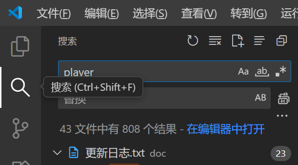

# 如果你想要，你得自己来拿

阅读自机相关的 data 内容对理解自机运行的原理有很大帮助。读 data 这件事并不容易，我会在这个教程里作一些整理，但是我仍然非常希望你亲自去读一读 data。如果你不知道如何查阅 data，也许这一页可以帮到你。

要阅读 data，通常你需要一个代码编辑器，比如

代码编辑器能够提供全局查找文件、文本的功能，以及对 lua 语言的语法高亮、查找引用等的支持。我将以 vscode 为例介绍查找自机相关 data 的方法，如果你在使用其他编辑器，也可以适当的参考。如果你在使用记事本，呃，你开心就好......

我们在 vscode 中安装 emmylua 或者 sumneko lua 插件，从而给 lua 语言提供支持。打开 LuaSTG 所在的文件夹，文件夹里应该包含所有的 lua 文件，我们要看的就是这些 Lua 文件。

为了方便以后查看 data，我们可以把工作区另存为文件，以后直接点开文件就可以打开工作区。我个人喜欢用 project manager 插件，这样我连工作区文件都不用找了 (笑)。

我们可以按 `ctrl+p` 快捷键搜索名字里带 "player" 的文件，有 `player.lua`, `player_system.lua` 两个 lua 文件，它们包含了自机系统的大部分逻辑，我们之后会重点分析。

使用左侧工具栏的搜索功能 (或者按快捷键 `ctrl+shift+f`)，可以搜索所有文件中出现的 "player"。由于自机的特殊性，与自机相关的地方几乎都会含有 "player"。虽然搜索结果大部分并不重要而且挺难看懂，但这样我们可以几乎没有遗漏地找到所有的自机相关内容。

全局搜索 (`ctrl+shift+f`)、搜索文件 (`ctrl+p`)、查找定义 (`f12`)、查找引用 (`shift+f12`) 四个功能在查阅 data 时非常实用，使用得当可以帮助你快速定位想要查找的内容。

于是自机相关的文件如下，你可以尝试用前面提到的方法搜索它们：
- [`THlib/player/player.lua`](../appendix/player-lua) \
  浅层的自机逻辑，涉及自机的基类以及一些自机相关的class和函数；
- [`THlib/player/player_system.lua`](../appendix/player-system-lua) \
  深层的自机逻辑，涉及大量的自机特有的属性和行为；
- `plugins/PlayerExtensions` \
  自带的灵梦、魔理沙、咲夜自机；
- [`THlib/WalkImageSystem.lua`](../appendix/wisys-lua) \
  自机使用的行走图系统 `PlayerWalkImageSystem`；
- [`doc/core/lstg.GameObject.lua`](../appendix/lstg-gameobject) \
  虽然不是自机相关，但这里说明了所有 class、object 共有的属性；
- `THlib/enemy/enemy.lua` \
  虽然也不是自机相关，但这里说明了自机子弹和敌机碰撞的逻辑。
