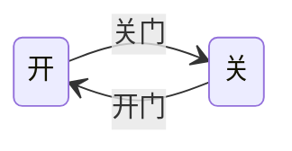
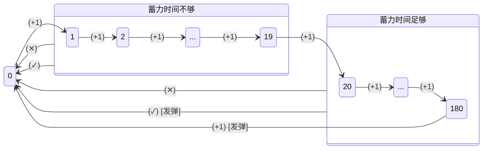

# 蓄力射击

这一期我们来实现神灵庙妖梦的蓄力射击。

低速射击时自机会开始蓄力，切换到高速射击时根据蓄力时间决定如何发射子弹。我们这么说起来容易，但一旦写起代码，很容易陷入混乱的逻辑处理中：

> "怎么计算蓄力时间?"
> 
> "自机停止射击了怎么办?"
>
> "我是不是还有什么特殊情况没考虑到?"

为了避免这种逻辑混乱导致代码出错，我们有一个常用的思路：**状态机**。

## 什么是状态机

状态机是一种描述 "系统在不同**状态**之间**转移**" 的模型。举一个简单的例子：假如一扇门有 "开" 和 "关" 两种状态，这扇门在一个时刻只能处于其中一种状态；"开门" 时门的状态会从 "开" 变成 "关"，"关门" 时门的状态会从 "关" 变成 "开"。这就是一个简单的状态机，我们可以用一个流程图来表示它的状态转移：



一个状态机具有以下要素：

1. 状态
2. 条件：某一时刻当条件被满足时，系统会执行一次状态转移 (状态不变也是一种转移)，以及执行一个额外动作 (没有动作也是一种动作)
3. 动作
4. 事件：一个事件描述一条状态转移逻辑：系统在某一**状态**，满足某一**条件**时，转移到哪个**状态**，并且执行什么**动作**

一个状态机应当具有以下关键特性：

1. 有限性：系统只有有限个可能的状态
2. 互斥性：同一时刻，系统只能处于一个状态，触发一个条件
3. 确定性：事件是确定的，即，系统在同一状态，满足同一条件时，总是转换到同一状态，并且执行同一动作

> 对互斥性的说明：假设一个系统由开关门和开关灯共同组成，那么此时 `(门:开/关, 灯:开/关)` 视为一个状态而不是两个状态，只要门不能既开又关、灯也不能既开又关，系统在一个时刻就仍然只能处于一个状态。条件同理，`(开/关门, 开/关灯)` 视为一个条件。

或许你感觉上面的内容不太好懂，我们可以说的简单一些：事件的确定性，使得一个状态机可以看成一个确定的**状态转移函数**

$$
    f(当前状态, 条件) \to (下一状态, 动作)
$$

考虑到这个函数的定义域 (输入参数，即当前状态和满足的条件) 的大小是有限的，列表法是一个不错的定义该函数的方法。例如，前面的开关门的状态机可以用下面的表格描述：

| 状态  | 条件  | 下一状态 |       动作       |
| :---: | :---: | :------: | :--------------: |
|  开   | 开门  |    开    |        -         |
|  开   | 关门  |    关    | (发出关门的声音) |
|  关   | 开门  |    开    | (发出开门的声音) |
|  关   | 关门  |    关    |        -         |

我们可以发现，如果已知所有可能的状态以及条件，我们就容易理清逻辑，充分考虑各种可能情况，编写出正确的代码。

> 注意：构造状态机时要注意避开 "伪态" 的错误：把某个 "动作" 当成一种 "状态" 处理。"状态" 是相对稳定的，如果没有外部条件，一个状态会一直持续下去；"动作" 是不稳定的，一旦执行完毕就结束了

## 蓄力射击的状态机

现在我们要构造蓄力射击系统的状态机。

首先，需要确定系统有哪些状态。我们考虑直接把蓄力时间 (单位：帧) 作为状态，虽然蓄力时间有无限多个状态，并不符合状态机的特性，但只要能确定状态转移函数就问题不大。不过如果需要同一蓄力时间在同一条件下有不同动作，那么问题很大，需要重新考虑如何构造系统的状态。

然后我们考虑从事件或者转移条件入手。因为我们明确知道蓄力射击由自机的高低速、开火等自机状态驱动，我们可以列举出所有的事件。思考哪些自机状态会对蓄力时间和发弹动作造成影响，并遍历这些自机状态的可能情况，判断不同情况下的不同状态转移和动作，我们可以整理出下面的事件：

1. 火力过低 (低于 1P) 时，蓄力时间归零，表示不能蓄力，没有动作
2. 松开射击键时，蓄力时间归零，表示取消蓄力，没有动作
3. 条件 1,2 不满足 (即火力足够，且正在射击) 时，
   1. 若处于低速，则蓄力时间增加，表示正在蓄力，没有动作
   2. 若处于高速，则应该尝试发弹：
      1. 若蓄力时间足够长 ($\geqslant20$ 帧)，则执行发弹动作，蓄力时间归零
      2. 若蓄力时间过短 ($<20$ 帧)，则不执行动作，蓄力时间也归零
   3. 额外地，若蓄力时间过长 ($>180$ 帧)，则直接执行发弹动作，蓄力时间归零

为了方便，我们用以下记号表示所有可能的状态转移条件：

- `(+1)`：蓄力时间增加的条件：自机火力足够、正在射击、处于低速
- `(✓)`：尝试发弹的条件：自机火力足够、正在射击、处于高速
- `(✕)`：不蓄力的条件：火力过低，或不射击

进而我们可以画出蓄力射击的状态转移图 (`[发弹]`表示执行发弹动作)：



可以检查一下，每个状态在不同条件下怎么转移。图中没有画出 0 状态 `(✓)(✕)` 条件怎么转移状态，是因为此时状态不变也没有动作，可以省略不画。

确定了上面的状态转移图之后，我们可以写出状态转移表格，之后可以很容易地把表格转化成实际代码：

|     **状态**     | **条件** | **下一状态** | **动作** |
| :--------------: | :------: | :----------: | :------: |
| $x$ ($\neq 180$) |  `(+1)`  |    $x+1$     |    -     |
|      $180$       |  `(+1)`  |     $0$      |   发弹   |
|    $x$ (任意)    |  `(✕)`   |     $0$      |    -     |
|   $x$ ($< 20$)   |  `(✓)`   |     $0$      |    -     |
|  $x$ ($\ge 20$)  |  `(✓)`   |     $0$      |   发弹   |

```lua
function ExtraPlayer:frame()
    player_class.frame(self)
    -- 自机状态
    local has_enough_power = int(lstg.var.power / 100) > 0
    local is_shooting = self.fire > 0.9
    local is_slow = self.slow == 1
    -- 状态转移条件
    local cond_clear = not (has_enough_power and is_shooting)
    local cond_charging = not cond_clear and is_slow
    local cond_firing = not cond_clear and not is_slow
    -- 状态转移事件
    if cond_clear then
        self.charge_counter = 0
    elseif cond_charging then
        if self.charge_counter < self.max_charge_time then
            self.charge_counter = self.charge_counter + 1
        else
            charge_bullet.create(
                self.x, self.y,
                int(lstg.var.power / 100),
                self.charge_counter)
        end
    elseif cond_firing then
        if self.charge_counter >= self.min_charge_time then
            charge_bullet.create(
                self.x, self.y,
                int(lstg.var.power / 100),
                self.charge_counter)
        end
        self.charge_counter = 0
    end
end
```

完整代码见[自机代码下载](../mainline/appendix)。
