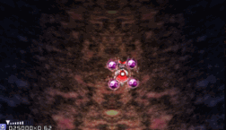

# 环绕子机

来一期简单的，地灵殿梦A的环绕子机。



我们在复刻灵梦自机时介绍过，可以通过 `self.slist` 表来设置稳定状态的子机位置，然后每帧读取 `self.sp` 表来实现子机渲染：

```lua
function ReimuPlayer:init()
    ---省略其他初始化操作
    self.slist = {
        {
            -- 0P 火力的子机位置
        },
        {
            -- 1P 火力的子机位置
            -- { 高速x, 高速y, 低速x, 低速y }
            { 0, 36, 0, 24 },
        },
        {
            -- 2P 火力的子机位置
            { -32, 0, -12, 24 }, -- 子机 1
            { 32,  0, 12,  24 }, -- 子机 2
        },
        {
            -- 3P 火力的子机位置
            { -32, -8,  -16, 20 },
            { 0,   -32, 0,   28 },
            { 32,  -8,  16,  20 },
        },
        {
            -- 4P 火力的子机位置
            { -36, -12, -16, 20 }, -- 子机 1
            { -16, -32, -6,  28 }, -- 子机 2
            { 16,  -32, 6,   28 }, -- 子机 3
            { 36,  -12, 16,  20 }, -- 子机 4
        },
    }
    self.slist[6] = self.slist[5]
end

function ReimuPlayer:render()
    -- 子机的渲染
    for i = 1, 4 do
        if self.sp[i] and self.sp[i][3] > 0.5 then
            Render(
                img .. "support",
                self.supportx + self.sp[i][1],
                self.supporty + self.sp[i][2],
                self.timer * 3
            )
        end
    end
    -- 行走图的渲染
    player_class.render(self)
end
```

不过，子机的渲染是完全由我们自己控制的，而 `slist` 和 `sp` 表从代码上只有 "`sp` 每帧根据 `slist` 作插值以实现 `sp` 的数据平滑过渡" 这样的关系。

虽然通常我们把 `slist` 和 `sp` 表的内容视为子机相对于自机的坐标，但我们可以稍作修改，把它们当成极坐标来使用，就可以轻松地实现子机环绕：

```lua
function ReimuPlayer:init()
    ---省略其他初始化操作
    local r1, r2 = 90, 30
    self.slist = {
        {},
        { { r1, 0, r2, 0 } },
        { { r1, 0, r2, 0 }, { r1, 180, r2, 180 } },
        { { r1, 0, r2, 0 }, { r1, 120, r2, 120 }, { r1, 240, r2, 240 } },
        { { r1, 0, r2, 0 }, { r1, 90, r2, 90 },   { r1, 180, r2, 180 }, { r1, 270, r2, 270 } },
        { { r1, 0, r2, 0 }, { r1, 90, r2, 90 },   { r1, 180, r2, 180 }, { r1, 270, r2, 270 } },
    }
    self.sp_angle = 0
end
function ReimuPlayer:frame()
    player_class.frame(self)
    if self.slow == 1 then
        self.sp_angle = self.sp_angle + 2
    else
        self.sp_angle = self.sp_angle + 5
    end
end
function ReimuPlayer:render()
    for i = 1, 4 do
        if self.sp[i] then
            -- 计算子机渲染坐标
            local dist = self.sp[i][1]
            local angle = self.sp[i][2] + self.sp_angle
            local x = self.supportx + dist * cos(angle)
            local y = self.supporty + dist * sin(angle)
            Render('leaf', x, y, self.timer * 2, self.sp[i][3], 1)
        end
    end
    player_class.render(self)
end
```

在此基础上，如果我们想更进一步，实现子机超出左右版边时可以在另一边渲染的效果，是很容易的。这里就不赘述了，详见[自机代码下载](../mainline/appendix)。
