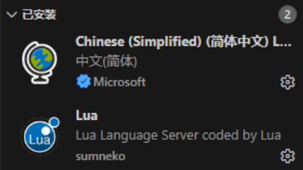
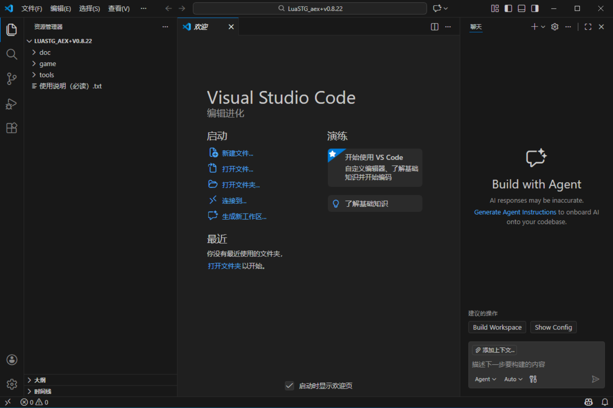
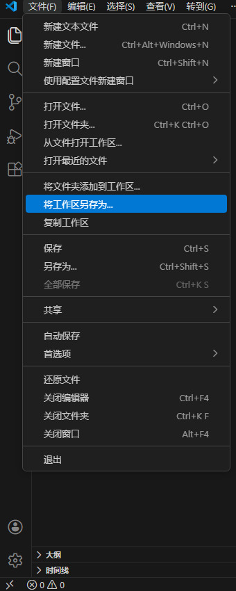
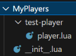
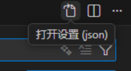
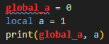

# Hello world！第一个自机

这一章我们将制作一个最简单的自机。

## 准备工作 {#preparation}

写自机主要是编写 lua 文件，因此我们 (通常) 需要有一个代码编辑器，比如


代码编辑器能够提供全局查找文件、文本的功能，以及对 lua 语言的语法高亮、查找引用等的支持。我将以 vscode 为例介绍编写自机之前的准备工作，如果你在使用其他编辑器，也可以适当的参考。如果你一定要用记事本，呃，你开心就好......

我们的准备工作不是很复杂：

1. 下载并安装 vscode (https://code.visualstudio.com/Download)
2. 安装简体中文插件和 lua 插件



3. 在 vscode 中打开 LuaSTG 文件夹



4. (可跳过) 打开设置 (快捷键 `ctrl+,`)，打开自动保存，这样就不用担心忘记保存了


5. (可跳过) 将工作区保存为文件，这样以后直接点开该文件就可以了



6. (可跳过) 设置全局变量的显示样式，从而更好地区分全局变量和局部变量，见[本页最后](#global-token)。

## 文件位置

aex+ (sub) 版本的自机一般以插件的形式存放在 `plugins` 文件夹，而比较老的 ex+ (plus) 版本的自机一般存放在 `THlib/player` 文件夹。这两种方式的生效原理稍有不同：

- 在旧版本，自机直接存放在 `THlib/player` 文件夹，由 `THlib/player/player.lua` 调用 `Include` 函数导入自机的 lua 文件，从而将自机导入游戏
- 在插件系统中，自机存放在 `plugins` 文件夹，由系统自动执行自机文件夹的入口文件 (`__init__.lua`)，从而将自机导入游戏

我们之后只讨论 aex+ (支持插件系统) 的自机编写。如果你仍停留在不支持插件系统的 ex+ 版本，那么可以略过关于 "入口文件" 的内容，以你所在版本的自带自机导入方法为准。

## 第一个自机

OK，现在我们正式开始写自机。

首先，我们在 `plugins` 文件夹里新建一个文件夹，名字随便取，这个文件夹就是我们创建的插件。然后在该文件夹里新建名为 `__init__.lua` 的文件，作为这个插件的入口文件。

入口文件 `__init__.lua` 一般用于导入其他的 lua 文件，自机逻辑在其他文件中实现。入口文件的大体内容如下：

```lua
lstg.plugin.RegisterEvent("afterTHlib", "插件标识名", 100, function()
    Include("文件的相对路径")
end)
```

- 使用 `RegisterEvent` 注册事件而非直接 `Include`，这是因为所有的插件都在同一时间导入，但不同插件实际生效的时间不同，因此需要通过 `RegisterEvent` 控制实际生效的时间
- `"afterTHlib"` 指定在 THlib 加载后执行事件。其他可选项有 `"beforeTHlib"`, `"afterMod"`，选择 `"afterMod"` 也可以的，但 `"beforeTHlib"` 不行，自机的定义依赖 THlib
- 插件标识名可以填任意的字符串，但不能与其他插件同名
- 100 是优先级，随便填一个数就行，插件的优先级一般没什么实质影响

我们着重说一说文件路径，LuaSTG 根据相对路径搜索文件时，会从**根目录**开始搜索。根目录可以有不止一个：

- 游戏的 exe 所在的文件夹：即 `game/`，这是最基本的根目录
- 当前 mod 所在的压缩包 (或文件夹)：使得制作弹幕时可以导入 mod 压缩包内的图片、音乐等资源
- 各插件所在的文件夹 (或压缩包)：使得插件可以方便地导入自己的文件
- 其他的根目录可以通过全局搜索找到 (vscode 打开 luastg 文件夹后，按 `ctrl+shift+f` 快捷键，搜索 `AddSearchPath`)

我们一般应该避免不同根目录下出现相同路径的文件，否则可能出现非预期的结果。例如，data 已经有 `THlib/player/player.lua` 文件，如果我们的插件里也有一个 `THlib/player/player.lua`，那么不能保证我们实际导入的是哪个文件。

总之我们终于可以写完 `__init__.lua` 了。假设我们插件的目录结构如下：



我们要导入 `test-player/player.lua`，那么 `__init__.lua` 的完整内容如下：

```lua
--- __init__.lua
lstg.plugin.RegisterEvent("afterTHlib", "My Players", 100, function()
    Include("test-player/player.lua")
end)
```

接下来，我们要在 `test-player/player.lua` 文件里编写自机。编写自机，实质上就是定义一个自机类 (就像做弹幕定义一个自定义 obj)，然后把这个自机类加入到自机列表。我们写入以下内容：

```lua
--- test-player/player.lua
TestPlayer = Class(player_class)
AddPlayerToPlayerList("test player", "TestPlayer", "test")

function TestPlayer:init()
    player_class.init(self)
    self.imgs = {}
    for i = 1, 24 do
        self.imgs[i] = "white"
    end
end
```

解释一下这个代码是怎么工作的：
1. `TestPlayer = Class(player_class)`：创建一个自机类 `TestPlayer`，继承了 `player_class` 基类。这个自机类会获得 `player_class` 类的[六个回调函数](../dataer/fields#class-methods)，从而拥有默认的自机行为。
2. `AddPlayerToPlayerList("test player", "TestPlayer", "test")`：将自机类添加到自机列表。三个函数参数依次为 选择自机时显示的名字、自机类的全局变量名、在 replay 中显示的名字，这要求自机类必须是一个全局变量。
3. `function TestPlayer:init() ...`：修改自机类的 init 回调，设置行走图 (`self.imgs`)。不设置行走图会报错所以我们加这一段，具体的工作原理留到下一章讲解（

这样我们就完成了一个非常朴素的自机，你可以运行游戏看一下效果。下一章我们将复刻一个灵梦自机，虽然整体上和自带的灵梦自机大差不差，但是会改掉一些不太好的写法，总之我们到时候再见啦。

## 附录：vscode 设置全局变量的显示样式 {#global-token}

打开设置，我们可以在右上角找到打开设置文件 (json 格式) 的入口，如图。



然后在设置文件中插入以下内容：

```json
"editor.semanticTokenColorCustomizations": {
    "enabled": true,
    "rules": {
        "variable.global": { // 全局变量
            "foreground": "#ff2929",
            "fontStyle": "bold"
        },
    }
},
```

这样，全局变量将以加粗的红色字体显示。


