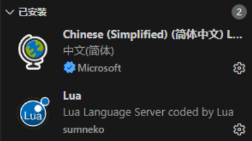
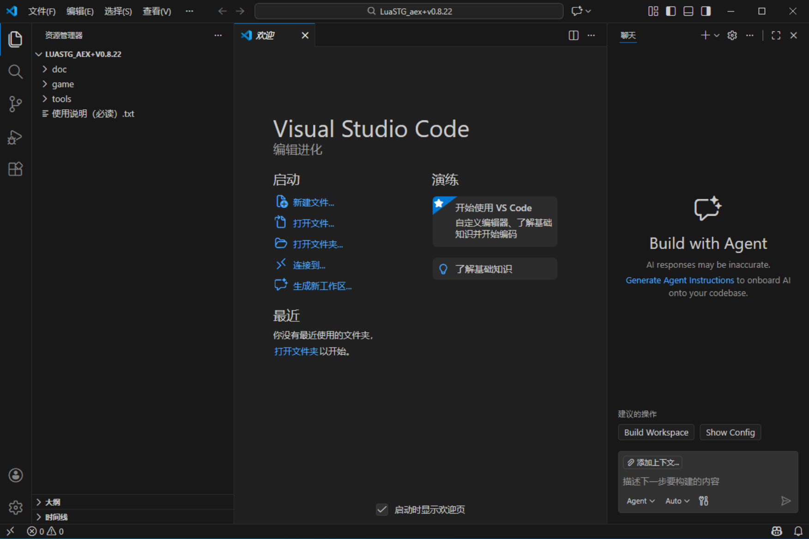
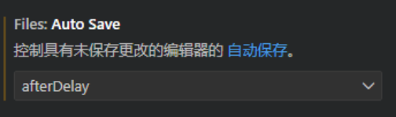
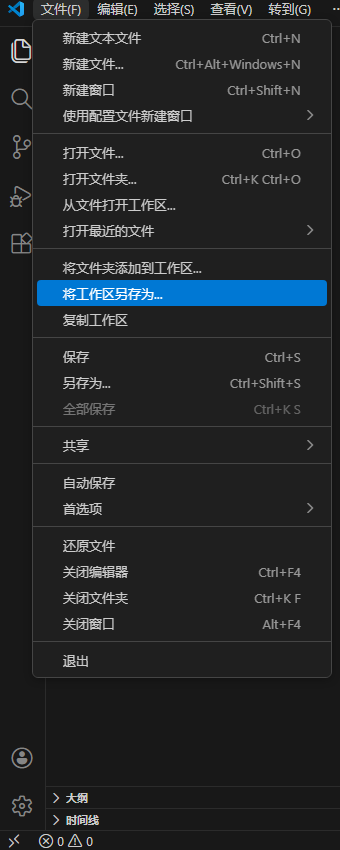
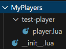
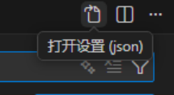
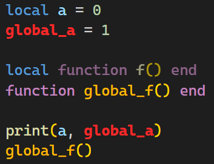

# Hello world！第一个自机

这一章我们将进行制作自机前的准备，并编写一个简单的自机。

## 准备工作 {#preparation}

制作自机主要是编写 lua 脚本，因此我们（通常）需要有一个代码编辑器，比如


代码编辑器能够提供全局查找文件、文本，以及对 lua 语言的语法高亮、查找引用等功能。本教程将以 vscode 为例进行演示，如果你使用其他编辑器，也可以适当参考。如果你一定要用记事本，呃，你开心就好……

我们的准备工作不是很复杂：

1. 下载并安装 vscode (https://code.visualstudio.com/Download)
2. 安装简体中文插件和 lua 插件



3. 在 vscode 中打开 LuaSTG 的文件夹



4. （可跳过）打开设置（默认快捷键 `ctrl+,`），启用自动保存，这样就不用担心忘记保存了



5. （可跳过）将工作区保存为文件，以后直接点开该文件就可以在 vscode 中打开 LuaSTG 文件夹



6. （可跳过）设置全局变量的显示样式，从而更好地区分全局变量和局部变量，见[本页最后](#global-token)。

## 文件位置

aex+（sub）版本的自机以插件的形式存放在 `plugins` 文件夹。所谓插件，是一个文件夹或 zip 压缩包，里面包含一个入口脚本（`__init__.lua`），当引擎检测到入口脚本，就会执行它，从而实现插件的功能。这使得玩家导入新自机变得很方便，只需要把新的自机（压缩包形式即可）放在 `plugins` 文件夹即可。（不过在 `ex+` 版本制作的自机无法直接导入，因为那时引擎没有插件系统，制作的自机没有入口文件）

如果你使用的是不支持插件系统的 ex+（plus）版本，你可以看到默认自机存放在 `THlib/player` 文件夹，没有所谓的入口文件，导入自机的代码在 `player.lua` 中，新的自机可以在那里添加导入代码。

## 第一个自机

完成了准备工作，我们可以来写一个极简的自机。读者可以在本教程的附录页下载自机代码。

我们在 `plugins` 文件夹中新建一个文件夹，名字随意，这个文件夹就是我们创建的插件。假设我们的插件名为 `MyPlayers`，目录结构如下：



作为一个极简的自机，它只包含两个文件：

1. `__init__.lua`：插件的入口文件，我们一般专门用它导入其他的 lua 脚本，核心功能在其他 lua 脚本中实现
2. `test-player/player.lua`：我们将在这里编写自机的核心代码

那么我们现在编写 `__init__.lua` 来导入另一个脚本 `test-player/player.lua`：

```lua
--- __init__.lua
lstg.plugin.RegisterEvent("afterTHlib", "My Players", 100, function()
    Include("test-player/player.lua")
end)
```

1. `Include(...)` 函数会执行文件路径对应的 lua 脚本（也就是我们说的 “导入”），类似功能的函数还有 `DoFile` 和 `require`，它们的差别这里不做介绍，有机会再说吧
2. 我们在外面套了一个 `RegisterEvent`（注册事件），这是因为所有的插件会在同一时机导入，但不同的插件实际生效的时机不同，因此需要通过 `RegisterEvent` 来控制插件的核心代码实际导入的时机
  - 它的第一个参数 `"afterTHlib"` 指定在 THlib 加载后执行事件。其他可选项有 `"beforeTHlib"`、`"afterMod"`，我们选择 `"afterMod"` 也可以的，但 `"beforeTHlib"` 不行，自机的定义依赖 THlib
  - 第二个参数 `"My Players"` 是插件的标识名，它可以填任意的字符串，但不能与其他的插件同名
  - 第三个参数 100 是优先级，数值越大，插件越先加载。一般随便填一个数就行，影响不大

额外谈一谈文件路径，LuaSTG 根据相对路径搜索文件时，会从**根目录**开始搜索。根目录可以有不止一个：

1. 游戏的 exe 文件所在的文件夹：最基本的根目录
2. 当前 mod 所在的压缩包 (或文件夹)：使得制作弹幕时可以导入 mod 压缩包内的图片、音乐等资源
3. 各插件所在的压缩包 (或文件夹)：使得插件可以方便地导入自己的文件
4. 其他的根目录可以通过全局搜索找到 (vscode 打开 luastg 所在文件夹后，按 `ctrl+shift+f` 快捷键，搜索 `AddSearchPath`)

我们一般应该避免不同根目录下出现相同路径的文件，否则可能出现非预期的结果。例如，data 已经有 `THlib/player/player.lua` 文件，如果我们的插件里也有一个文件的相对路径是 `THlib/player/player.lua`，那么不能保证我们实际导入的是哪个文件。

---

接下来，我们要在 `test-player/player.lua` 文件里编写自机。这实质上就是定义一个自机类 (就像制作弹幕时定义一个自定义 obj)，然后把这个自机类加入到自机列表。我们写入以下内容：

```lua
--- test-player/player.lua
TestPlayer = Class(player_class)
AddPlayerToPlayerList("test player", "TestPlayer", "test")

function TestPlayer:init()
    player_class.init(self)
    self.imgs = {}
    for i = 1, 24 do
        self.imgs[i] = "white"
    end
end
```

1. 第一行我们定义了一个自机类，定义自机类的写法是固定的 `xxx = Class(player_class)`
  - `Class(base)` 函数用于创建一个新的类，新的类会将函数参数 `base` 作为它继承的基类，或者不填参数的话，继承 `object` 类
  - 新的类将会获得基类的[六个回调函数](../dataer/fields#class-methods)
  - 通过继承 `player_class` 基类，新的自机类会拥有默认的自机行为
2. 第二行我们将新的自机类添加到自机列表，这样在游戏的选择自机界面我们才能选择它
  - `AddPlayerToPlayerList` 就是专门往自机列表添加新自机的函数
  - 第一个参数是在游戏界面显示的自机名
  - 第二个参数是自机类的全局变量名，利用 lua 全局变量的机制，data 可以根据全局变量名找到对应的自机类，但这要求自机类**必须**是一个全局变量
  - 第三个参数是在 replay 界面显示的自机名
3. `function TestPlayer:init() ...`：为了让新的自机能跑就行，我们不得不修改它的 init 回调，设置行走图（`self.imgs`），不设置行走图的话游戏会报错

这样我们就完成了一个非常朴素的自机，可以运行游戏看一下效果。下一章我们将复刻一个灵梦自机，虽然整体上和自带的灵梦自机大差不差，但是会改掉一些不太好的写法，总之我们到时候再见啦。

## 附录：vscode 设置全局变量的显示样式 {#global-token}

打开设置，我们可以在右上角找到打开设置文件 (json 格式) 的入口，如图。



然后在设置文件中插入以下内容：

```json
"editor.semanticTokenColorCustomizations": {
    "enabled": true,
    "rules": {
        "variable.global": { // 全局变量
            "foreground": "#ff2929",
            "fontStyle": "bold"
        },
    }
},
```

这样，全局变量将以加粗的红色字体显示。


