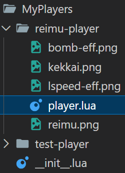
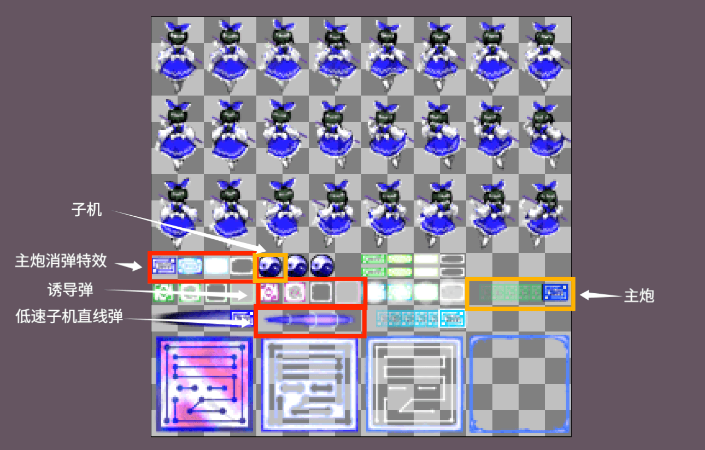
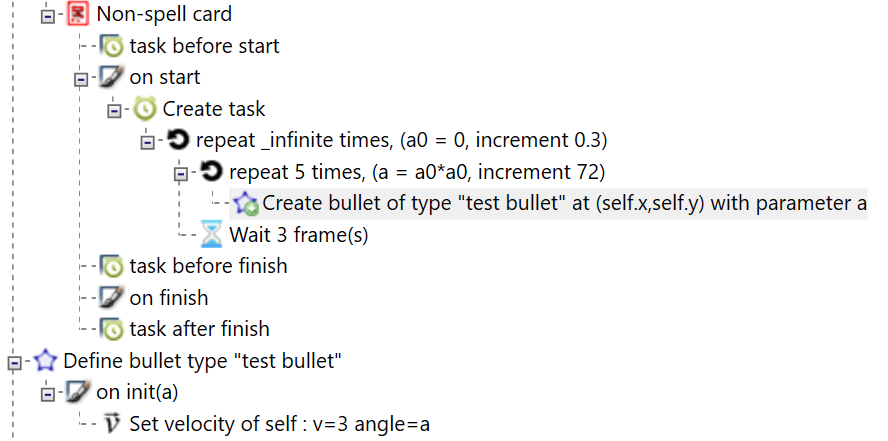
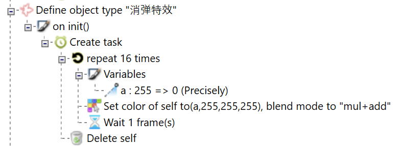

# 复刻：灵梦自机

上一节我们介绍了自机插件的整体结构：

- 入口文件 `__init__.lua` 负责导入其他 lua 文件
- 其他 lua 文件负责定义自机类并加入到自机列表

并给出了一个简短的自机示例。这一节我们将在此基础上，复刻 LuaSTG 自带的灵梦机体，完整代码见[附录：自机代码下载](./appendix)。

## 总览

这次自机的文件结构如下，我们主要关注怎么在 `reimu-player/player.lua` 里编写自机逻辑。



首先我们导入 `player.lua`：

```lua
--- __init__.lua
lstg.plugin.RegisterEvent("afterMod", "My Players", 100, function()
    -- Include("test-player/player.lua")
    Include("reimu-player/player.lua")
end)
```

来到 `player.lua`，创建自机类 `ReimuPlayer`，然后用 `AddPlayerToPlayerList` 添加到自机列表。

```lua
ReimuPlayer = Class(player_class)
AddPlayerToPlayerList("Hakurei Reimu 2P", "ReimuPlayer", "Reimu")
```

剩下的任务，就是视情况换掉自机的默认行为。具体来说，我们考虑重写 `ReimuPlayer` 自机类的以下回调函数：

- `ReimuPlayer:init()` 初始化，一般包括资源加载、自机属性设置
- `ReimuPlayer:frame()` 帧逻辑
- `ReimuPlayer:render()` 渲染，一般包括自机本身的渲染、子机的渲染、其他相关组件的渲染
- `ReimuPlayer:shoot()` 通常射击，一般包括子弹 obj 实例的创建
- `ReimuPlayer:spell()` 雷，像是在写符卡
- `ReimuPlayer:special()` 按下 c 键时的行为

## 初始化

如果我们不重写 init (初始化) 回调，创建自机时会执行基类 `player_class` 的 init 回调，从而完成默认的初始化行为。即相当于

```lua
-- 冒号 ":" 是 lua 的语法糖, 效果是在函数参数最前面添一个 self
-- 即等价于 function ReimuPlayer.init(self)
function ReimuPlayer:init()
    player_class.init(self)
end
```

与一些 lua 教程讲面向对象的情况不同，之后传入的 `self` 参数是新创建的自机实例 obj，而不是类 `ReimuPlayer` 本身。

然后我们设置一些自机属性，基本的初始化工作就完成了：

```lua
-- 自机类
ReimuPlayer = Class(player_class)
-- 添加自机类到自机列表
AddPlayerToPlayerList("Hakurei Reimu 2P", "ReimuPlayer", "Reimu")

-- 前置
local img = "reimu-player:"
local lib = {}

-- 初始化回调
function ReimuPlayer:init()
    player_class.init(self)
    lib.load_resources()

    -- 高低速
    self.hspeed, self.lspeed = 4, 2
    -- 判定大小
    self.A, self.B = 0.5, 0.5
    -- 行走图
    self.imgs = {}
    for i = 1, 24 do
        self.imgs[i] = img .. "player" .. i
    end
end

-- 导入图片等资源
function lib.load_resources()
end
```

- `hspeed,lspeed`：high speed 和 low speed 的简写，自机的高速/低速，默认值为 4/2。
- `A,B`：之所以不是通常的 `a,b`，是因为改变贴图 (`img` 属性) 会同时改变判定大小 (根据加载贴图时的设置)，自机的行走图系统根据 `A,B` 属性重新修正判定大小。
- `imgs`：自机的行走图，[一般](../dataer/fields#imgs)是一个包含 24 张图片的列表，
  - 前 8 张为静止动画，整体为一个循环节；
  - 中间 8 张为左移动画，倒数 4 张为循环节；
  - 后 8 张为右移动画，倒数 4 张为循环节。
- `..` 是 lua 的一个运算符，表示字符串拼接。

这里我们在文件开头设置了 `img` 和 `lib` 两个局部变量。`img = "reimu-player:"` 用来给资源名加一个固定前缀，防止和其他地方的资源名重复。`lib = {}` 用来存放一些 obj 和函数，以免像自带自机那样把它们定义成全局变量。

我们定义了 `lib.load_resources()` 函数，在初始化时调用，用来导入需要的资源，比如 `self.imgs` 里的行走图 (现在还没导入，马上)。

## 导入资源

资源加载与设置的相关函数比较杂乱，我不太想一一介绍，想详细了解可以看耳教程 (LuaSTG教程by无耳) 和 LuaSTG 的 data (主要位于 `doc/lstg.ResourceManager.lua` 和 `lib/Lresources.lua`)。以后有空可能会好好介绍一下吧...... /* TODO */

灵梦用到的资源种类还挺全面的，能搞懂以下所有函数的用法基本肯定够用了。

```lua
-- 前置
local img = "reimu-player:"
local tex = "reimu-player:"
local dir = "reimu-player/"
local lib = {}

-- 导入图片等资源
function lib.load_resources()
    LoadTexture(tex .. "reimu", dir .. "reimu.png")
    -- 行走图
    LoadImageGroup(img .. "player", tex .. "reimu", 0, 0, 32, 48, 8, 3)
    -- 主炮子弹
    LoadImage(img .. "bullet-main", tex .. "reimu", 192, 160, 64, 16, 16, 16)
    SetImageState(img .. "bullet-main", "", Color(160, 255, 255, 255))
    SetImageCenter(img .. "bullet-main", 56, 8)
    -- 主炮子弹消弹特效
    LoadAnimation(img .. "bullet-main-eff", tex .. "reimu", 0, 144, 16, 16, 4, 1, 4)
    SetAnimationState(img .. "bullet-main-eff", "mul+add", Color(160, 255, 255, 255))
    -- 子机诱导弹 (hspeed)
    LoadImage(img .. "bullet-trail", tex .. "reimu", 64, 160, 16, 16, 16, 16)
    SetImageState(img .. "bullet-trail", "", Color(128, 255, 255, 255))
    -- 诱导弹消弹特效
    LoadAnimation(img .. "bullet-trail-eff", tex .. "reimu", 64, 160, 16, 16, 4, 1, 4)
    SetAnimationState(img .. "bullet-trail-eff", "mul+add", Color(160, 255, 255, 255))
    -- 子机直线弹 (lspeed)
    LoadImage(img .. "bullet-lspeed", tex .. "reimu", 64, 176, 64, 16, 64, 16)
    SetImageState(img .. "bullet-lspeed", "", Color(128, 255, 255, 255))
    -- 子机直线弹消弹特效
    CopyImage(img .. "bullet-lspeed-eff1", img .. "bullet-lspeed")
    LoadAniFromFile(img .. "bullet-lspeed-eff2", dir .. "lspeed-eff.png", false, 1, 9, 1)
    SetAnimationCenter(img .. "bullet-lspeed-eff2", 0, 8)
    SetAnimationState(img .. "bullet-lspeed-eff2", "mul+add", Color(255, 128, 0, 255))
    -- 子机
    LoadImage(img .. "support", tex .. "reimu", 64, 144, 16, 16)
    -- 高速 bomb
    CopyImage(img .. "spell-ball", "parimg1")
    LoadImageFromFile(img .. "bomb-eff", dir .. "bomb-eff.png")
    -- 低速 bomb 结界
    LoadImageFromFile(img .. "kekkai", dir .. "kekkai.png")
    SetImageState(img .. "kekkai", "mul+add", Color(128, 64, 64, 255))
end
```

`reimu.png`：



## 子机

接下来我们把子机渲染出来。data 提供了一套管理子机位置的方案：制作者通过 `self.slist` 属性设置稳定状态的子机位置 $\longrightarrow$ data 每帧根据 `self.slist`、当前火力值、高低速状态进行插值，计算出子机坐标，写入 `self.sp` 属性 $\longrightarrow$ 制作者根据 `self.sp` 渲染各个子机。

稳态子机位置表 `self.slist` 支持对 0P, 1P, ..., 4P 火力分别设置子机坐标，**最多支持 4 个子机，且子机数量不能随火力增大而减少**。灵梦自机的 `self.slist` 如下所示 (写在 init 回调)：

```lua
-- 子机位置
self.slist = {
    {
        -- 0P 火力的子机位置
    },
    {
        -- 1P 火力的子机位置
        -- { 高速x, 高速y, 低速x, 低速y }
        { 0, 36, 0, 24 },
    },
    {
        -- 2P 火力的子机位置
        { -32, 0, -12, 24 }, -- 子机 1
        { 32,  0, 12,  24 }, -- 子机 2
    },
    {
        -- 3P 火力的子机位置
        { -32, -8,  -16, 20 },
        { 0,   -32, 0,   28 },
        { 32,  -8,  16,  20 },
    },
    {
        -- 4P 火力的子机位置
        { -36, -12, -16, 20 }, -- 子机 1
        { -16, -32, -6,  28 }, -- 子机 2
        { 16,  -32, 6,   28 }, -- 子机 3
        { 36,  -12, 16,  20 }, -- 子机 4
    },
}
-- 由于子机系统的一点小问题, 要在 4P 火力正常工作需要有 "5P 火力" 的子机位置
-- 一般会把 5P 和 4P 的数据设置成相同的
self.slist[6] = self.slist[5]
```

设置好 `self.slist` 之后，子机系统会帮我们每帧计算子机位置，计算结果存储在 `self.sp`。`self.sp` 的结构如下所示：

```lua
{
    -- { x, y, 有效性 0~1 }
    { -36, -12, 1 }, -- 子机 1
    { -16, -32, 1 }, -- 子机 2
    { 16,  -32, 1 }, -- 子机 3
    { 36,  -12, 1 }, -- 子机 4
}
```

然后我们可以根据 `self.sp` 渲染子机。对于子机 $i=1,2,3,4$，惯例做法是用 `self.sp[i][3] > 0.5` 判断子机是否有效，如果有效，则将 `self.sp[i][1], self.sp[i][2]` 视为子机的直角坐标进行渲染。

在这里介绍一组属性：`self.supportx, self.supporty`。support 表示子机，这组属性的字面意思是 "子机坐标"。它们会跟随自机坐标 `self.x, self.y`，但带有一点 "惯性"，经常用来代替 `self.x, self.y` 从而制造子机比自机慢半拍的视觉效果。

为了渲染子机，我们需要重写自机的渲染回调，在默认行为的基础上添加子机的渲染方法。我们用 `Render(img, x, y, rot, hscale, vscale)` 函数渲染子机贴图 (`rot, hscale, vscale` 不是必要的)：

```lua
-- 渲染回调
function ReimuPlayer:render()
    -- 子机的渲染
    for i = 1, 4 do
        if self.sp[i] and self.sp[i][3] > 0.5 then
            Render(
                img .. "support",              -- 贴图
                self.supportx + self.sp[i][1], -- x
                self.supporty + self.sp[i][2], -- y
                self.timer * 3                 -- 朝向
            )
        end
    end
    -- 行走图的渲染 (默认的渲染行为)
    player_class.render(self)
end
```

值得注意的是，子机位置表没有强制规定它的数据的含义。我们默认这些数据是以自机为原点，子机的相对坐标，但只要你有需求，它们可以是任何东西。一个经典的例子是通过把它们视为极坐标来实现环绕自机的子机。

注 1：如果你更想要把子机写成 obj，那也是可以的，只需要让子机 obj 读取自机的属性执行相关操作就可以。

注 2：如果你想要更灵活的子机配置，比如管理超过 4 个子机，可以考虑自己写一套子机系统。教程整合有相关教程 (子机位置更新与对自带子机位置更新系统的解析.docx)，本教程也有子机系统的 data 解析可以参考。

## 通常射击

下面我们来到通常射击。这一步简单来说就是在自机类的 shoot 回调里发射子弹来完成一轮通常射击。我们要做的就是定义一些子弹类，然后在 shoot 回调创建子弹实例。

回顾一下在符卡里我们是怎么做的：(虽然这个例子直接用简单弹更合适)



对应的 lua 代码可以选中节点按下 F2 查看，大体内容如下：

```lua
--- 符卡内容
do
    local a0, _d_a0 = (0), (0.3)
    for _ = 1, _infinite do
        do
            local a, _d_a = (a0 * a0), (72)
            for _ = 1, 5 do
                last = New(_editor_class["test bullet"], self.x, self.y, a)
                a = a + _d_a
            end
        end
        task._Wait(3)
        a0 = a0 + _d_a0
    end
end
--- 子弹定义
_editor_class["test bullet"] = Class(bullet)
_editor_class["test bullet"].init = function(self, _x, _y, a)
    bullet.init(self, arrow_big, COLOR_RED, true, true)
    self.x, self.y = _x, _y
    SetV2(self, 3, a, true, false)
end
```

由此我们可以把生成的代码和编辑器节点进行一个对照。自定义 obj 的定义节点 (define object type) 类似于 `my_class = Class(base_class)`，创建 obj (create object of type) 相当于 `New(my_class, ...)`。不过我不太建议抄编辑器的源码，它会有一些很绕很难看的写法，以及一些专门给编辑器用的东西 (比如 `_editor_class, SetV2, task._Wait`)，抄出问题很难排查。

灵梦的通常射击包括三种子弹：主炮的札弹、高速子机的诱导弹、低速子机的直线弹。

我们先看最简单的主炮子弹，它用到的图片素材如下：

<figure style='display: flex; justify-content: space-around;'>
    <div style='text-align: center;'>
        
        <figcaption>本体</figcaption>
    </div>
    <div style='text-align: center;'>
        
        <figcaption>消弹动画</figcaption>
    </div>
</figure>

我们用两个类 `bullet_main, bullet_main_eff` 来实现主炮子弹，`bullet_main` 是主炮子弹的本体，在击中敌人后创建 `bullet_main_eff`，用来渲染消弹效果。

关于对象的定义和创建，目前有一套新的更加推荐的代码风格，记录在 data 的 `lib/Lobject.lua`。相比 data、自带自机、编辑器等地方的代码风格，新的风格更适应 vscode 等代码编辑器，性能也更好，我们来看一下。

```lua
-- 创建 bullet_main 类
lib.bullet_main = lstg.CreateGameObjectClass() -- 或者 xxx = Class(object)

-- 定义 create 方法, 创建对象时使用该方法而不是 New 函数
-- 这样代码编辑器 (如vscode) 可以给我们提供相应的代码提示
-- 该方法相当于传统风格的 init 回调
function lib.bullet_main.create(x, y, dmg)
    -- 创建一个 bullet_main 实例
    local self = New(lib.bullet_main)

    -- 设置该实例的若干属性
    self.group = GROUP_PLAYER_BULLET
    self.layer = LAYER_PLAYER_BULLET
    self.img = img .. "bullet-main"
    self.x, self.y = x, y
    self.rot = 90
    self.vy = 24
    self.dmg = dmg
    -- 导入贴图时填写了判定大小 (16, 16)
    -- 设置对象的 img 属性时会自动把贴图的判定信息写入对象
    -- 所以以下设置判定大小的代码可以省略不写
    -- 如果你需要重新指定碰撞判定, 请在设置 img 属性后再设置 a,b,rect 属性
    -- self.a, self.b = 16, 16

    -- 返回该实例, 顺手的事
    return self
end
-- 如果想要利用已有的子弹类 player_bullet_straight 简化代码
-- 请显式调用该类的方法, 而不是用传统风格 bullet_main = Class(player_bullet_straight) 去继承该类
-- 比如我们可以这样写:
-- function lib.bullet_main.create(x, y, dmg)
--     local self = New(lib.bullet_main)
--     player_bullet_straight.init(self, img .. "bullet-main", x, y, 24, 90, dmg)
--     return self
-- end

-- kill 回调, 在对象被 kill 时会自动调用该方法
function lib.bullet_main:kill()
    -- 生成消弹特效
    lib.bullet_main.create_eff(self.x, self.y)
end

-- 主炮消弹特效
lib.bullet_main_eff = lstg.CreateGameObjectClass()

-- 由于对象的创建完全由我们自己控制, 我们可以随便给 create 方法起名
-- 比如这里是把 create 方法挂在本体类上
-- 甚至可以直接写 local function create_bullet_main_eff(x,y) ... end
-- (当然为了作用域不出问题得把函数挂到 lib 上)
function lib.bullet_main.create_eff(x, y)
    local self = New(lib.bullet_main_eff)
    -- 注意一下碰撞组和图层
    self.group = GROUP_GHOST
    self.layer = LAYER_PLAYER_BULLET + 50
    -- img 为动画资源时会自动循环播放
    self.img = img .. "bullet-main-eff"
    self.x, self.y = x, y
    self.rot = 90
    self.vy = 2.25
    return self
end

function lib.bullet_main_eff:frame()
    -- 共4张图, 每4帧换下一张图, 共16帧
    -- timer 计数器从0开始, 0~15 共16帧, 动画播放一轮
    if self.timer == 15 then
        Del(self)
    end
end
```

初始化对象属性时，你可以检查下面的列表来防止遗漏：

- 碰撞组：`group`
- 图层：`layer`
- 贴图信息：`img`
- 运动：`x, y, vx, vy, ax, ay`
- 贴图渲染：`rot, omiga, hscale, vscale`
- 碰撞判定：`a, b, rect`
- 子弹伤害：`dmg, killflag`
- 取消出界自动删除：`bound`

子机发射的子弹类也是差不多的定义，篇幅原因我们就不详细介绍了，只谈一些细节。想看详细代码可以去[附录：自机代码下载](./appendix)下载。

### 设置颜色

低速子机的直线弹有一个消弹特效是逐渐变成透明的，如果是在编辑器里我们可以这么写：



很遗憾，我们现在没有高级循环，也没有 set color，也没有 task (这个以后会有)。

LuaSTG 中设置颜色是针对贴图而言的，通过 `SetImageState` 函数实现，设置之后在任何地方渲染贴图都会受到影响。所以当我们确定一个贴图的颜色会发生变化时，我们就不会在导入贴图时设置颜色，而是在对象要渲染该贴图时设置颜色。比如以下对消弹特效的渲染：

```lua
function lib.bullet_lspeed_eff1:render()
    -- 让不透明度逐渐从 255 减到 0
    local a = 255 * (1 - self.timer / 16)
    SetImageState(self.img, "mul+add", Color(a, 255, 255, 255))
    DefaultRenderFunc(self) -- 默认渲染
end
```

我们也可以用 `SetImgState(unit, blend, a, r, g, b)` 设置 `unit.img` 贴图的颜色，但是同样地，其他共用该贴图的对象也会受到影响。

### 时序控制

还是这个消弹特效，我们需要让它的不透明度随时间逐渐减到 0 然后删掉它。在编辑器里写弹幕时，我们一般会考虑用 task 和循环来解决。而对于自机子弹，由于控制逻辑比较简单，并且 task 不是很方便用，所以一般是用 `self.timer` 计数器进行时序控制 (比如前面代码里的 `local a = 255 * (1 - self.timer / 16)`)。

如果遇到比较复杂的时序控制需要用 task 来处理，也是可以的，我们在后面高速 bomb 再详细介绍。

### 诱导弹

利用 data 提供的诱导弹模板 `player_bullet_trail` 我们可以比较方便地定义诱导弹：

```lua
-- 此处省略消弹特效相关内容
lib.bullet_trail = lstg.CreateGameObjectClass()

function lib.bullet_trail.create(x, y, rot, trail, dmg)
    local self = New(lib.bullet_trail)
    player_bullet_trail.init(self, img .. "bullet-trail", x, y, 8, rot, nil, trail, dmg)
    return self
end

function lib.bullet_trail:frame()
    player_class.findtarget(self)
    player_bullet_trail.frame(self)
end
```

- 初始化时 `target` (追踪目标) 填 `nil` 即可，因为之后会每帧更新目标。
- `player_class.findtarget(self)` 会寻找一个要追踪的敌人，并写入 `self.target` 属性。
- `player_bullet_trail.frame(self)` 负责更新子弹速度和朝向，实现追踪效果。
- 诱导弹模板的解析见 [`player_bullet_trail`](../dataer/player#trail)。
- 选择追踪哪个敌人的逻辑见 [`player_class.findtarget`](../dataer/player#playerclass-findtarget)。

### shoot 回调

定义了子弹类之后，我们在 shoot 回调里创建子弹实例：

```lua
function ReimuPlayer:shoot()
    -- 
    self.nextshoot = 4
    lstg.PlaySound("plst00", 0.3, self.x / 1024)
    -- 主炮
    lib.bullet_main.create(self.x + 10, self.y, 2)
    lib.bullet_main.create(self.x - 10, self.y, 2)
    -- 子机子弹
    for i = 1, 4 do
        if self.sp[i] and self.sp[i][3] > 0.5 then
            if self.slow == 1 then
                -- 低速: 直线弹
                lib.bullet_lspeed.create(
                    self.supportx + self.sp[i][1] - 3,
                    self.supporty + self.sp[i][2],
                    0.3
                )
                lib.bullet_lspeed.create(
                    self.supportx + self.sp[i][1] + 3,
                    self.supporty + self.sp[i][2],
                    0.3
                )
            else
                -- 高速: 诱导弹
                if self.timer % 8 < 4 then
                    -- 0~4P --> 1~5
                    local power = int(lstg.var.power / 100) + 1
                    lib.bullet_trail.create(
                        self.supportx + self.sp[i][1],
                        self.supporty + self.sp[i][2],
                        self.anglelist[power][i],
                        900, 0.7
                    )
                end
            end
        end
    end
end
```

- `nextshoot`：倒计时形式的冷却时间，每帧减一，减到 0 之前 shoot 回调不会执行。设置为 4 使得每 4 帧进行一次射击。
- `lstg.PlaySound`：这是原始的播放音效函数。data 重写了一个提供默认音量值的版本，也就是目前普遍使用的 `PlaySound`，但是它截至 `aex+ 0.9.0` 仍有问题，默认会忽略传入的音量值，所以我们最好用原始的 `lstg.` 版本。
- 这里写的是先遍历子机，再判断高/低速，也可以反过来先判断高/低速再遍历子机，随你喜好。
- `self.anglelist`：为了让不同子机的诱导弹有不同的速度方向，我们可以在 init 回调定义如下列表。注意 `anglelist` 并不是 data 内置的属性，而是我们自己额外定义的。你可以用你喜欢的名字，比如 `angles, angle_list, angleList` 等，只要不与其他已有属性重名即可。

```lua
self.anglelist = {
    { 90,  90,  90, 90 },
    { 90,  90,  90, 90 },
    { 100, 80,  90, 90 },
    { 100, 90,  80, 90 },
    { 110, 100, 80, 70 },
}
```

## Bomb

终于来到了灵梦的高速雷和低速雷。data 会帮我们处理 bomb 数量的变化逻辑，我们只需要处理剩余的逻辑，主要是发射弹幕、调整收点线以及一些特效。如果之前的通常射击你能够看懂，那么我应该不需要详细解释以下代码：

```lua
-- Bomb 对应回调
function ReimuPlayer:spell()
    -- 调整收集线，过几秒调回来
    self.collect_line = self.collect_line - 500
    New(tasker, function()
        task.Wait(90)
        self.collect_line = self.collect_line + 500
    end)

    if self.slow == 1 then
        -- 低速 bomb
        self.nextspell = 240 -- 冷却时间
        self.protect = 360   -- 无敌时间
        lstg.PlaySound("power1", 0.8)
        lstg.PlaySound("cat00", 0.8)
        misc.ShakeScreen(210, 3) -- 震屏
        -- 遮罩
        New(player_spell_mask, 64, 64, 255, 30, 210, 30)
        -- 结界的整体判定和渲染
        lib.kekkai.create(self.x, self.y)
    else
        -- 高速 bomb
        self.nextspell = 300
        self.protect = 360
        lstg.PlaySound("nep00", 0.8)
        lstg.PlaySound("slash", 0.8)
        New(player_spell_mask, 128, 0, 255, 30, 180, 30)
        local a0 = ran:Int(0, 360)
        -- 梦想封印
        for i = 1, 8 do
            lib.spell_ball.create(self.x, self.y, 8, a0 + i * 45, 4, 1200, 200 - 10 * i, 230, 1, 35)
        end
    end
end
```

- 调整收点线：数值调大点，别像自带自机那样 $\pm300$ 然后自机在版底正好收不到点 (气笑了)。
- `New(tasker)`：对应编辑器的 create tasker 节点，一般用于死尸弹。如果想改用 task 也是可以的，不过需要每帧 `task.Do(self)`，后面会详细说明。
- `player_spell_mask` 这种 data 自带的类还是只能用 `New()` 创建实例对象，比较遗憾。

下面我们分别看一下作为 bomb 主体的两个对象类 `lib.kekkai` 和 `lib.spell_ball` 的思路，然后灵梦自机堂堂完结。

## 低速：结界

结界是一个经典的渲染和碰撞分离设计的类，它的碰撞判定是一个半径逐渐增大的圆，而渲染则由若干个方框贴图组成。它的代码就是以下两个类的混合：

只负责碰撞判定的类：

```lua
function lib.kekkai.create(x, y)
    local self = New(lib.kekkai)
    self.group = GROUP_PLAYER_BULLET
    self.x, self.y = x, y

    self.a, self.b = 0, 0
    self.dmg = 1.25
    -- 将 killflag 设为 true 会使得子弹与敌机碰撞后不会被删除
    -- 同时也会使子弹的伤害变为帧伤, 调控伤害时需要注意
    self.killflag = true

    local dr = 12
    self.r, self.dr = 0, dr
end

function lib.kekkai:frame()
    -- 控制每6帧播放击中音效
    self.mute = (self.timer % 6 ~= 0)
    -- 扩大判定范围
    self.r = self.r + self.dr
    self.a, self.b = self.r, self.r
    -- 消除子弹的对象, 只会存在一帧所以可以每帧创建
    New(bomb_bullet_killer, self.x, self.y, self.a, self.b)
end
```

只负责渲染的类：

```lua
function lib.kekkai.create(x, y)
    local self = New(lib.kekkai)
    self.layer = LAYER_PLAYER_BULLET
    self.img = img .. "kekkai"
    self.x, self.y = x, y

    local dr = 12
    local n = 20
    local t = 12

    -- 自定义变量
    self._a = 128
    self.list, self.n = {}, 0
    -- dr / 256 是因为图片资源的长宽为 256 像素
    self.dscale = dr / 256

    task.New(self, function()
        -- 创建各层结界的渲染信息
        for i = 1, n do
            self.list[i] = { scale = 0, rot = 0 }
            self.n = i
            task.Wait(t)
        end
        -- 淡出
        for i = 128, 0, -4 do
            self._a = i
            task.Wait(1)
        end
        Del(self)
    end)
end

function lib.kekkai:frame()
    -- 使得 task 可以正常执行
    task.Do(self)
    -- 结界渲染信息更新
    local omega = 1
    for i = 1, self.n do
        self.list[i].scale = self.list[i].scale + self.dscale
        self.list[i].rot = self.list[i].rot + omega
        omega = omega * -1
    end
end

function lib.kekkai:render()
    SetImgState(self, "mul+add", self._a, 64, 64, 255)
    for i = 1, self.n do
        -- 渲染各层结界
        Render(self.img, self.x, self.y, self.list[i].rot, self.list[i].scale)
    end
end
```

总的来说，只要能理解碰撞和渲染分开设计的思路，那么结界类应该不难看懂。

## 高速：梦想封印

梦想封印是一个比较难做的 bomb，无论是时序控制、运动逻辑、渲染还是消弹特效都不是很容易实现。我的能力不足以在这里把这个 bomb 讲明白，所幸它用到的东西在这一章都讲到了 (应该)。如果你已经了解了前面的内容，想要挑战一下自己，那么可以去阅读[灵梦自机](../assets/MyPlayers.zip)的 `lib.spell_ball` 部分，我写了一些注释以帮助理解。

你也可以尝试自己写一个梦想封印，对于刚学自机的人可能会很困难，但是可以大大增加经验值。如果你觉得无从下手，可以参考以下流程来一点点地完成：

- 在 sharp 编辑器里制作弹幕，实现梦想封印的时序控制和运动
- 把你实现的弹幕逻辑移植到自机 bomb，贴图随便用什么都行
- 在编辑器/自机代码里另外实现一个 obj，拥有梦想封印里阴阳玉的渲染效果
- 把这个渲染效果移植到你实现的 bomb
- 实现消弹特效和其他一些零散的逻辑

## 结语

总的来说，LuaSTG 自带的灵梦机体是一个比较基础的自机 (除了梦想封印)，覆盖的内容比较丰富，适合新手入门 (除了梦想封印)。

而借着这个教程，我终于有机会把自带灵梦机体的代码翻新，引入了更适合代码编辑器的代码风格，修改了原机体的很多不明所以让人困惑的地方，加入了一点注释来帮助理解。我翻新的时候感觉很快乐，我也希望读者看到这份代码也能感受到快乐w

之后会讲解如何实现一些常见 (或许不常见) 的自机机制，比如自动雷、魔理沙的激光、蓄力射击等；并且会翻新自带的魔理沙机体，但应该不会有一页教程专门讲解它。总之这个自机教程的主线到这里就结束了，希望你看得开心！
